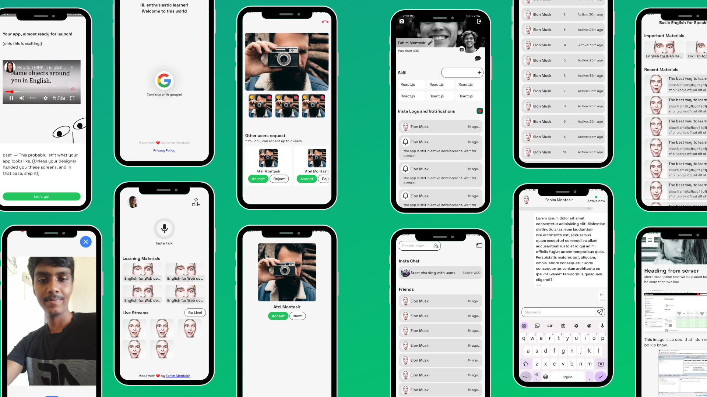

# English Sphere: Live, Breathe, Speak English.

`English Sphere` is where you dive into English. Imagine it as your personal world where you're surrounded by the language. The tagline reminds you to make English a part of you, not just something you study occasionally. Like breathing, let it flow naturally. This makes your speaking strong and confident. So, adopt English every day, and soon, you'll be fluent and awesome!

## Development status

All previous application code is now **legacy**. The only active codebase is [`_latest-es/`](_latest-es/), where English Sphere is being rebuilt with the current Expo/React Native, Elysia, Better Auth, Drizzle, and PostgreSQL stack.

Legacy application directories—including `englishSphere/`, `backend/`, `dashboard/`, `web/`, and `rse-shop/`—are retained only for historical reference and feature migration. New development must not be added to them. The `rse-shop` marketplace and all commerce features are excluded from the new English Sphere product.

## Current plan

- Rebuild the established English-learning, conversation, community, content, and administration features in `_latest-es/`.
- Add privacy-conscious on-device English AI for conversation, dictation, speech-to-text, and text-to-speech using small, device-qualified models.
- Add small-model server inference with evaluated English coaching, pronunciation, grammar, vocabulary, and conversation feedback.
- Build permission-aware RAG over curated learning content and learner-approved history, with grounded answers and citations.
- Provide a secured OAuth-based MCP service for compatible ChatGPT and Gemini clients.
- Apply model evaluation, consent, privacy, safety, observability, licensing, and cost controls throughout the AI system.

The detailed product requirements, AI research, architecture, and implementation roadmap are maintained in [`openspec/changes/document-product-and-ai-platform/`](openspec/changes/document-product-and-ai-platform/).

## Legacy product preview

Design reference: [Figma](https://www.figma.com/file/AAmi8RVuUCNjv4Yt4Q7Gs4/refactor-speaking?node-id=0%3A1)

### Contributors

- [Contributors guide](https://docs.google.com/document/d/1-Az4toFIeWPUh8gmZ5NkNPGAcNj-npHkCqeZ994KrCo/edit?usp=sharing)
- mahidul
